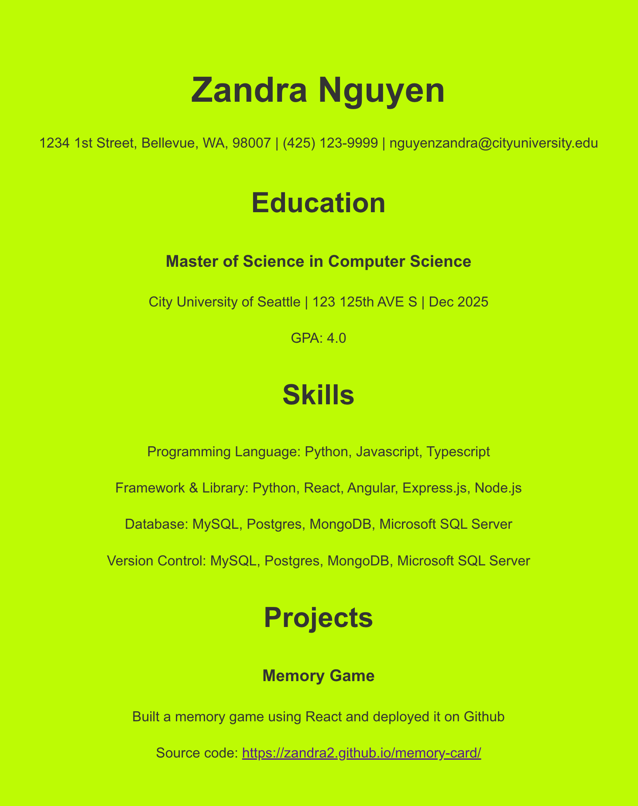

# MyResume
This project is using React to create a personal resume

#### input-process-output model:
1. A requirement from the environment (input)
2. A computation based on the requirement (process)
3. A provision for the environment (output)

## Input
Runs the app in the development mode.

Open [http://localhost:3000](http://localhost:3000) to view it in your browser.


## Process
1. Create a Github repo called Resume
2. Select the code button, from the tab select Codespaces and then create codespace on main.
3. In the terminal run:
```
npx create-react-app replaceWithAppName
```
4. CD to client directory from terminal and create resume.js and resume.css
5. Add your code. Once satified. To start up your app, run:
```
npm start
```
6. Open [http://localhost:3000](http://localhost:3000) to view it in your browser. 

## Output
.
